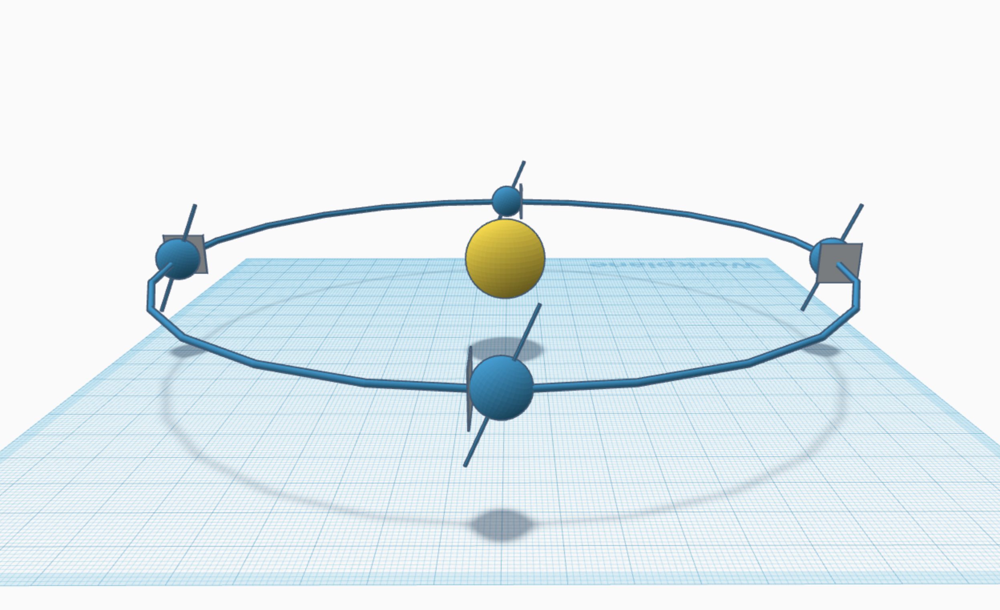

## Overview

Earth Moon Model (EMM) is a tabletop digital art project that combines a Raspberry Pi
computer with sensors and actuators to create a realistic model of the Earth and
the Moon in their orbits.

## Design

The image on the left is a rendering of EMM. The design source is
freely available on [TinkerCAD](https://www.tinkercad.com/things/2K7GgXmbFCp).

The image on the right illustrates the perspective of the EMM observer.
The observer follows the Earth as it travels around the Sun, with the Sun always
due west of the observer.

| Model | Model Perspective               |
|----------------|---------------------------------|
|  |  |