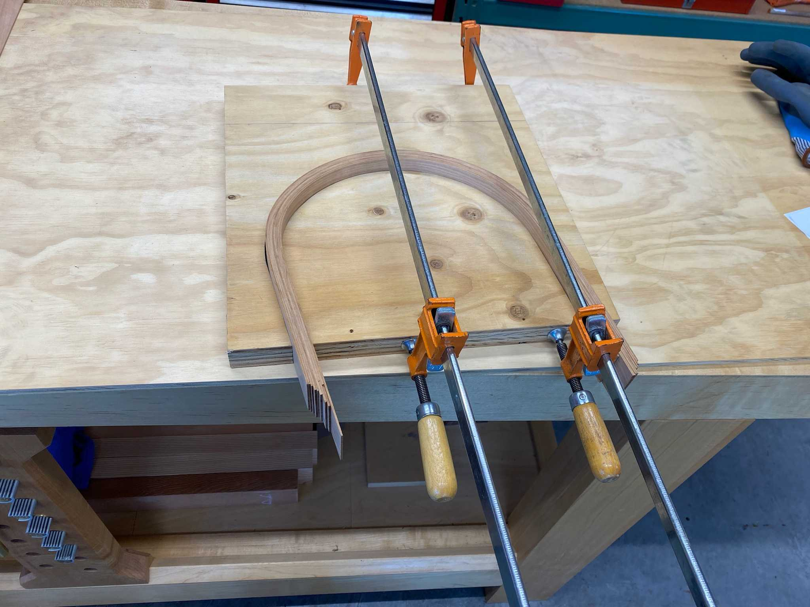

## Overview

Earth Moon Model (EMM) is a tabletop digital art project that combines a Raspberry Pi
computer with sensors and actuators to create a realistic model of the Earth and
the Moon in their orbits.

This project is an extension to [Earth Model](https://github.com/ebarlas/earth-model), 
which has a much simpler footprint that lacks a moon. 

## Design

The image on the left is a rendering of EMM. The design source is
freely available on [TinkerCAD](https://www.tinkercad.com/things/2K7GgXmbFCp).

The image on the right illustrates the perspective of the EMM observer.
The observer follows the Earth as it travels around the Sun, with the Sun always
due west of the observer.

| CAD Model                               | Assembled Model          |
|-----------------------------------------|--------------------------|
|  |  |

| Model Perspective                 |
|-----------------------------------|
|  |

## Parts

* Raspberry Pi Zero W
* Adafruit Stepper Motor, NEMA-17 size, 200 steps/rev, 12V 350mA (x3)
* Adafruit Stepper Motor HAT (x2)
* Hall effect sensor (x3)
* Tiny round disk magnet (x3)
* 5V 2A power supply

## Software

EMM is running on a Raspberry Pi Zero W with [DietPi OS](https://dietpi.com/docs/).
DietPi is a highly optimized and minimal Debian-based Linux distribution.

At the time of this writing, DietPi version `8.9.2` is installed. It runs atop Linux kernel version `5.15`.

```
# uname -a
Linux DietPi 5.15.61+ #1579 Fri Aug 26 11:08:59 BST 2022 armv6l GNU/Linux
```

Python3 is required.

```
apt-get install python3
apt-get install python3-pip
```

The following Python package dependencies are required:

* [`skyfield`](https://rhodesmill.org/skyfield/) - library for calculating astronomical predictions
* [`adafruit_motorkit`](https://github.com/adafruit/Adafruit_CircuitPython_MotorKit) - library for controlling stepper motors
* [`RPi.GPIO`](https://pypi.org/project/RPi.GPIO) - library for interacting with Raspberry Pi GPIO pins

```
pip3 install skyfield
pip3 install adafruit-circuitpython-motorkit
pip3 install RPi.GPIO
```

The following was also necessary with my setup. See https://github.com/numpy/numpy/issues/14553.

```
apt-get install libatlas-base-dev
```

## Assembly

A small amount of soldering is required to assemble the components.

Neither the Raspberry Pi Zero W nor the Adafruit Stepper Motor HAT
have header pins pre-installed. The first step in preparing the electronics is
to solder those headers to allow basic connectivity.

* Solder male pin headers to Raspberry Pi Zero W
* Solder stacking headers to lower Stepper Motor HAT
* Solder female pin headers to upper Stepper Motor HAT
* Solder terminal blocks to lower Stepper Motor HAT
* Solder terminal blocks to upper Stepper Motor HAT

|                         |                         |
|-------------------------|-------------------------|
|  |  |

## Current Draw

The Raspberry Pi Zero W alone draws about 113 mA of current.

Each motor draws roughly an additional 140 mA of current.

Together, the system draws about 538 mA of current as measured with a multimeter.

Tests were conducted by activating the stepper motors one at a time via a simple
Python REPL.

```python
from adafruit_motorkit import MotorKit
kit = MotorKit()
kit.stepper1.onestep() # engage 1st motor
kit.stepper2.onestep() # engage 2nd motor
kit2 = MotorKit(address=0x61)
kit2.stepper1.onestep() # engage 3rd motor
```

| RPi                         | 1 Motor                     | 2 Motors                    | 3 Motors                    |
|-----------------------------|-----------------------------|-----------------------------|-----------------------------|
|  |  |  |  |

## Modules

`earth.py`
* Uses `skyfield` library to calculate earth orbit, earth rotation, and moon orbit given a point in time
* All rotation values range from 0 to 360
* Test module `earth_test.py`
* Defines `Earth` class

`sensor.py`
* Uses `RPi.GPIO` library to yield a sensor signal `True` or `False`
* Defines `Sensor` class

`motor.py`
* Uses sensor input to orient motor shafts to reference positions
* Implements a simple scan algorithm to discover sensor region and to move to the midpoint
* Test module `motor_test.py`
* Defines `Motor` class

`model.py`
* Governs trio of motors in coordination
* Includes awareness that earth-rotation and moon-orbit motors are mounted on earth-orbit motor
* Test module `model_test.py`
* Defines `Model` class

`main.py`
* Main application entry point
* Utilizes modules above
* Does the following:
  * Moves motor shafts to reference positions
  * Moves motor shafts to target position based on earth and moon positions
  * Check positions minutely, moving motor shafts as needed 

## Wood Working

The incredible Lance Barlas constructed wood components based on the 3D model above.

|                             |                             |
|-----------------------------|-----------------------------|
|      |      |
|  |  |
|  |  |
|     |         |
|     |                             |